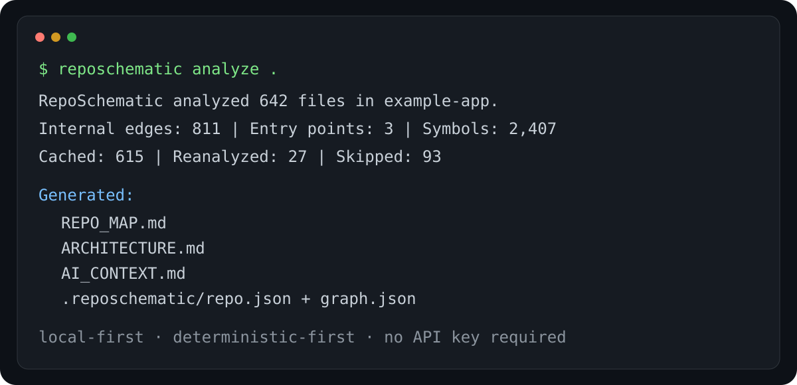

# RepoSchematic

**Understand a codebase before you touch it.**

RepoSchematic is a local-first CLI that turns an unfamiliar repository into an evidence-backed structural map for developers and AI coding agents. It discovers the project, parses source structure, resolves internal imports, ranks important files, identifies entry points, and produces compact documentation that explains where to start.

<p align="center">
  
</p>

## Why

Opening a new repository usually starts with the same questions:

- Where does execution begin?
- Which files are actually central?
- How do modules depend on each other?
- Where should a developer or coding agent start reading?
- What can be summarized without copying the entire codebase into an AI context window?

RepoSchematic answers those questions with static evidence first. The core does **not** require an LLM, API key, cloud service, vector database, or account.

## What it generates

Run:

```bash
reposchematic analyze .
```

RepoSchematic creates:

```text
REPO_MAP.md          # orientation, entry points, important files, evidence
ARCHITECTURE.md      # internal dependency diagram + analysis boundaries
AI_CONTEXT.md        # compact context for Codex, Claude Code, Cursor, etc.
.reposchematic/
  repo.json          # machine-readable repository model
  graph.json         # machine-readable internal dependency graph
  cache.json         # local incremental-analysis cache
```

The `.reposchematic/` state directory is local by design and ignored by RepoSchematic's own project. `reposchematic init` also adds it to a Git repository's local `.git/info/exclude` when possible.

## Quick start

RepoSchematic requires Python 3.10+.

```bash
# From a local clone of this repository
python -m venv .venv

# macOS / Linux
source .venv/bin/activate

# Windows PowerShell
# .venv\Scripts\Activate.ps1

python -m pip install .
reposchematic doctor .
reposchematic analyze .
```

For stronger JavaScript/TypeScript parsing, install the optional Tree-sitter extra:

```bash
python -m pip install ".[treesitter]"
```

Without that extra, JavaScript/TypeScript still receives a conservative dependency-free analysis rather than failing outright.

## CLI

| Command | Purpose |
|---|---|
| `reposchematic init .` | Create local config/state, protect local state from Git, and analyze |
| `reposchematic scan .` | Discover analyzable files without static analysis |
| `reposchematic analyze .` | Build the model and generate all outputs |
| `reposchematic map .` | Print the repository map to stdout |
| `reposchematic explain path/to/file.py` | Explain one file's structural role |
| `reposchematic deps path/to/file.py` | Show internal imports and reverse dependencies |
| `reposchematic entrypoints .` | List detected entry points with confidence |
| `reposchematic stats .` | Show analysis statistics |
| `reposchematic doctor .` | Check path, permissions, local state, and discovery |

Several commands support `--json` for automation.

## Example

```text
$ reposchematic analyze .
RepoSchematic analyzed 42 files in my-project.
Internal edges: 51 | Entry points: 2 | Symbols: 113
Cached: 34 | Reanalyzed: 8 | Skipped: 7
Generated:
  - .reposchematic/repo.json
  - .reposchematic/graph.json
  - REPO_MAP.md
  - ARCHITECTURE.md
  - AI_CONTEXT.md
```

A generated map emphasizes evidence rather than opaque prose:

```text
src/app.py — critical
  • declared or conventional entry point
  • imported by 4 files
  • connects to 7 internal modules

src/services/user.py — high
  • imported by 6 files
  • defines 5 symbols
```

Entry points also carry confidence and evidence, for example a console script declared in `pyproject.toml` is stronger evidence than a filename convention such as `main.py`.

## How it works

```text
Repository
   │
   ▼
Git-aware discovery / safe filesystem fallback
   │
   ▼
Language-aware static analysis
   │
   ├─ Python: stdlib AST
   └─ JS / TS: optional Tree-sitter AST, conservative fallback otherwise
   │
   ▼
Internal repository graph
   │
   ▼
Evidence-backed ranking + entry-point detection
   │
   ▼
Markdown + JSON outputs for humans and coding agents
```

RepoSchematic prefers Git's own tracked/untracked view when a `.git` repository is available, so normal `.gitignore` rules are honored. Outside Git, it uses a conservative filesystem scanner with common generated directories excluded.

See [docs/ARCHITECTURE.md](docs/ARCHITECTURE.md) for the internal design.

## Deterministic-first, not AI-first

RepoSchematic intentionally does not ask an LLM to guess the architecture. Its first release uses file structure, manifests, AST/static analysis, import resolution, entry-point declarations, and structural connectivity.

That gives the output useful properties:

- it works offline;
- it is cheap to rerun;
- important claims can point to concrete evidence;
- source code is not uploaded anywhere by the core tool;
- output changes are driven by repository changes rather than model phrasing.

An optional explanatory AI layer may be explored later, but it will not replace the deterministic core.

## Incremental analysis

RepoSchematic hashes discovered files and stores analysis results in `.reposchematic/cache.json`. On later runs, unchanged files are restored from cache and only changed files are reanalyzed.

Generated RepoSchematic documents and its local state directory are excluded from subsequent analysis to avoid the tool analyzing its own outputs.

## Privacy and safety

Core guarantees for v0.1.0:

- no telemetry;
- no account;
- no network calls;
- no API key required;
- common secret files (`.env`, private keys, credential directories) are excluded;
- binary and oversized files are skipped by default;
- source bodies are not copied into the generated context documents.

RepoSchematic is **not** a secret scanner or sandbox. A normal source file may still contain confidential identifiers, symbol names, or import paths. Review generated documents before publishing them from a private repository.

See [docs/PRIVACY.md](docs/PRIVACY.md) and [SECURITY.md](SECURITY.md).

## Configuration

`reposchematic init` creates `.reposchematic.toml`:

```toml
max_file_bytes = 1000000
use_cache = true
# ignore_dirs = ["vendor", "generated"]
```

The configuration is deliberately small in v0.1.0.

## Current language support

| Language | v0.1.0 analysis |
|---|---|
| Python | AST-backed functions, classes, imports, calls, framework hints |
| JavaScript | Optional Tree-sitter AST; conservative fallback |
| TypeScript / TSX | Optional Tree-sitter AST; conservative fallback |
| JSON / TOML / YAML / Markdown | Discovery and project metadata |
| Other languages | File-level discovery only |

See [docs/LIMITATIONS.md](docs/LIMITATIONS.md) for the honest boundaries of static analysis.

## Project structure

```text
src/reposchematic/
  analyzers/        language-aware analysis
  cache.py          incremental file analysis cache
  cli.py            user-facing commands
  discovery.py      Git-aware and filesystem discovery
  graph.py          internal import resolution
  intelligence.py   importance ranking and statistics
  metadata.py       manifests, dependencies, entry points
  models.py         canonical repository model
  renderers.py      Markdown and JSON outputs
  security.py       sensitive-path guardrails
  service.py        analysis orchestration

tests/              unit + integration tests
docs/               architecture, privacy, limitations, development
examples/           usage examples
scripts/            smoke/release checks
```

## Development

```bash
python -m pip install -e ".[dev]"
pytest
python scripts/smoke_test.py
```

To exercise the optional JS/TS AST parser too:

```bash
python -m pip install -e ".[dev,treesitter]"
pytest
```

## Roadmap

The project is intentionally narrow. Likely next steps include better symbol-level graph resolution, more framework-aware entry-point detection, richer JS/TS AST extraction, a compact token-budgeted agent output, and additional languages only when their parsers can be supported reliably.

See [ROADMAP.md](ROADMAP.md).

## Contributing

Bug reports, small parser improvements, fixture repositories, documentation corrections, and language adapters are welcome. See [CONTRIBUTING.md](CONTRIBUTING.md).

## License

MIT. See [LICENSE](LICENSE).
